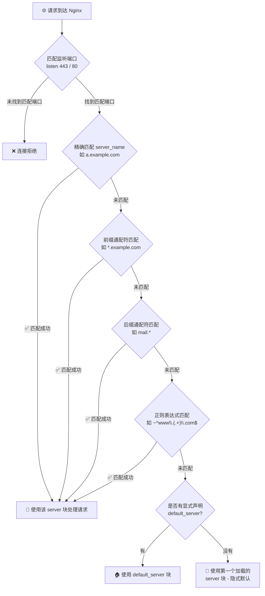
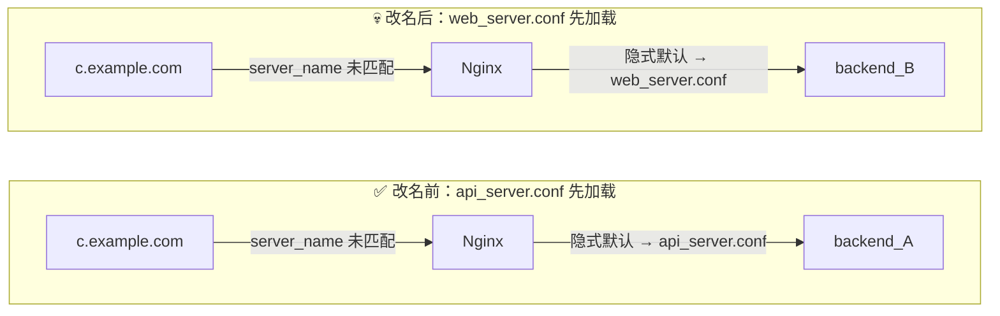

如果你问一个刚配置过几次 Nginx 的开发者："如果 HTTP 请求的域名在 Nginx 配置的 `server_name` 里找不到，会发生什么？"

十有八九的人会回答："请求会被拒绝"、"会报 404 错误"，或者"直接无法访问"。

但事实真的是这样吗？今天我们就通过一个真实的 SSL 通配符证书案例，来扒一扒 Nginx 路由背后那个常被忽视的"兜底机制"——`default_server`。

<!--more-->

## 案例重现：意料之外的"访问成功"

假设我们有这样一台 Nginx 服务器，配置了 HTTPS，并且手头有一张 `*.example.com` 的通配符证书。我们的配置文件里只写了两个子域名：

```nginx
# Nginx 配置片段
server {
    listen 443 ssl;
    server_name a.example.com b.example.com; # 只配置了 a 和 b
    
    ssl_certificate /path/to/wildcard.crt;   # *.example.com 通配符证书
    ssl_certificate_key /path/to/wildcard.key;
    
    location / {
        proxy_pass http://backend_server;
    }
}
```

现在，我们在 DNS 解析处，将 `c.example.com` 的 A 记录也指向了这台 Nginx 服务器的 IP。

**问题来了：当我们用浏览器访问 `https://c.example.com` 时，能访问通吗？**

按照我们的"刻板印象"，`server_name` 里根本没有 `c.example.com`，这绝对访问不通。

但**真实结果是：不仅能访问通，而且 SSL 证书显示安全（绿锁），请求被完美转发到了 `backend_server`！**

为什么会这样？这就引出了 Nginx 真正的请求匹配逻辑。

## 深度解析：Nginx 的"退而求其次"法则

当 Nginx 接收到一个 HTTP/HTTPS 请求时，它的匹配逻辑并不是非黑即白的"要么匹配，要么拒绝"，而是一套完整的优先级瀑布流。先看全貌，再逐级拆解：



具体来说，每一级的匹配规则如下：

### 1. 匹配端口（优先级最高）

请求到达时，Nginx 首先看的是**端口**。在上面的案例中，浏览器访问 `https://c.example.com`，请求准确无误地到达了服务器的 `443` 端口。

### 2. 匹配 server_name（四级优先级瀑布）

确认端口后，Nginx 会提取请求头中的 `Host` 字段（即 `c.example.com`），去所有监听了 443 端口的 `server` 块中，按以下**严格优先级**逐级尝试匹配 `server_name`：

| 优先级 | 匹配类型 | 示例 | 说明 |
|:---:|------|------|------|
| 1 | **精确匹配** | `server_name a.example.com;` | 完全一致，优先级最高 |
| 2 | **前缀通配符** | `server_name *.example.com;` | 以 `*.` 开头的通配 |
| 3 | **后缀通配符** | `server_name mail.*;` | 以 `.*` 结尾的通配 |
| 4 | **正则表达式** | `server_name ~^www\.(.+)\.com$;` | 以 `~` 开头的正则 |

> ⚡ 注意：如果同一优先级有多个匹配，Nginx 使用**最长匹配**原则（通配符）或**配置文件中出现顺序**（正则）。

在我们的案例中，`c.example.com` 在这四级中都**没有找到**匹配。

### 3. 终极绝招：寻找默认服务器（default_server）

这就是打破我们刻板印象的关键！**当所有 `server_name` 都匹配失败时，Nginx 绝对不会直接把请求扔掉，而是会在该端口下寻找一个"默认收容所"。**

- **隐式默认：** 如果所有监听 443 端口的 `server` 块都没有显式声明 `default_server`，Nginx 会默认将配置文件中**排在最上面（第一个加载）**的 `server` 块作为默认服务器。
- **显式默认：** 如果某个 `server` 块写了 `listen 443 ssl default_server;`，它就是官方指定的兜底。

**破案了！** 在我们的案例中：

1. `c.example.com` 找不到匹配的 `server_name`。
2. Nginx 退而求其次，把请求塞给了 443 端口的**默认服务器**（即我们配置了 a 和 b 的那个唯一的 server 块）。
3. 恰好，这个块里配置的是 `*.example.com` 通配符证书，完美覆盖了 `c.example.com` 的域名校验，浏览器不报警。
4. 请求顺理成章地被 `proxy_pass` 转发到了后端。

> 💡 **补充：SNI 与 TLS 握手的关系**
>
> 你可能会问：TLS 握手不是发生在 HTTP 请求之前吗？Nginx 怎么在握手阶段就知道域名？答案是 **SNI（Server Name Indication）**。现代浏览器在 TLS ClientHello 阶段就会携带目标域名，Nginx 据此选择对应的证书和 server 块。如果客户端不支持 SNI（极其罕见），Nginx 会直接使用默认 server 块的证书进行握手。

## 进阶思考：这是特性还是 Bug？

了解了这个机制后，我们会发现它像一把双刃剑。

**如果是单站服务器**，这个机制极其方便。你甚至可以完全不写 `server_name`，只要域名解析过来了，Nginx 就能稳稳当当地把流量接住。

**如果是多站服务器**，这个机制可能就是一场灾难。假设你在同一个 Nginx 上托管了公司的官网（通配符证书）和内部测试系统（另一个证书），如果配置不当，用户随便输一个未备案的乱码域名解析到你的 IP，或者直接用 IP 访问，就可能直接看到你的默认站点。

## 最佳实践：如何优雅地掌控全局？

为了避免"迷路"的请求意外进入不该进的后端，最标准的做法是**主动配置一个无情的 Catch-all（兜底）服务器**。

在配置文件的最前面，或者显式使用 `default_server`，拦截所有未匹配的域名和直接 IP 访问：

```nginx
# 专门处理无家可归请求的兜底 server
# ⚠️ 建议文件名以 00_ 开头，确保在字母序中最先加载
server {
    listen 80 default_server;
    listen 443 ssl default_server;
    server_name _; # _ 是一个无效域名的占位符
    
    # ⚠️ 即使是兜底块，HTTPS 端口也必须配置证书，否则 Nginx 无法启动
    # 可以用 openssl 快速生成自签名证书：
    # openssl req -x509 -nodes -days 3650 -newkey rsa:2048 \
    #   -keyout /etc/nginx/ssl/dummy.key -out /etc/nginx/ssl/dummy.crt \
    #   -subj "/CN=dummy"
    ssl_certificate /etc/nginx/ssl/dummy.crt; 
    ssl_certificate_key /etc/nginx/ssl/dummy.key;
    
    # 444 是 Nginx 特有状态码：直接断开连接，不返回任何数据
    return 444; 
}

# 你真正提供服务的 server
server {
    listen 443 ssl;
    server_name a.example.com b.example.com;
    # ... 正常业务配置
}
```

> ⚠️ **关键提醒**：每个端口只能有**一个** `default_server`。如果你不小心在多个 server 块中声明了 `listen 443 ssl default_server;`，Nginx 会发出 `warn` 级别日志，并以最后加载的那个为准——又回到了依赖加载顺序的老问题。

## 总结

Nginx 的 `server_name` 并不是拦截请求的"铁门"，而更像是指路的"路牌"。当路牌上找不到你要去的地方时，Nginx 不会让你原地罚站，而是会把你送进默认的"收容所"。

理解了 Nginx 基于端口的 `default_server` 兜底机制，我们不仅能搞懂那些莫名其妙的"串号"访问，更能写出更加健壮、安全的服务器配置。下次再配置 Nginx，别忘了给你的服务器安排一个靠谱的"兜底"逻辑！

---

## 隐藏的潜规则：不写 default_server 听谁的？

顺着刚才的思路，我们再开一个脑洞。假设有两个 server 块都监听 443 端口，而且**它们用的都是同一张 `*.example.com` 的通配符证书**，**而且我们的配置文件里，所有的 443 端口都没有写 `default_server` 呢？**

```nginx
# 第一个 443 块（排在文件上方）
server {
    listen 443 ssl;
    server_name a.example.com b.example.com;
    ssl_certificate /path/wildcard.crt; # *.example.com 的证书
    
    location / {
        proxy_pass http://backend_A;
    }
}

# 第二个 443 块（排在文件下方）
server {
    listen 443 ssl; 
    server_name d.example.com;          
    ssl_certificate /path/wildcard.crt; # 同样使用 *.example.com 的证书
    
    location / {
        proxy_pass http://backend_B;
    }
}
```

当你满怀疑惑地访问 `https://c.example.com` 时，Nginx 的内心戏是这样的：

1. 寻找 `server_name c.example.com` -> **没找到**。
2. 寻找带有 `default_server` 的 443 端口 -> **大家都没写**。
3. 触发 Nginx 隐式兜底潜规则：**直接把配置文件里排在最前面（第一个被加载）的那个 server 块，强行当做默认服务器！**

在这个例子中，排在第一的是配置了 `a` 和 `b` 的块。于是：

- Nginx 拿出了第一个块里的 `*.example.com` 证书进行握手。
- 浏览器一看，`c.example.com` 匹配通配符，绿锁放行！
- 请求被默默转发到了 **`backend_A`**。



### 真正的恐怖故事："薛定谔的路由"

你可能觉得："哦，大不了就是转到第一个配置里嘛，我知道是哪一个就行了。"

但现实生产环境中，这简直是一场噩梦。为什么？因为你的路由结果，完全取决于**代码的物理排版顺序**！

在稍微大一点的项目中，我们的 Nginx 配置通常不会写在一个巨大的 `nginx.conf` 里，而是使用 `include` 指令拆分成了多个文件：

```nginx
http {
    # 引入 conf.d 目录下所有的 .conf 文件
    include /etc/nginx/conf.d/*.conf; 
}
```

Nginx 加载这些配置文件的顺序，通常是**按照文件名的字母/数字顺序**来的！（严格来说，`include` 通配符的展开依赖操作系统的 `glob()` 系统调用。在 Linux 上，`glob()` 返回的结果是按字典序排列的；但在某些嵌入式系统或特殊文件系统中，排序行为可能不同。好在绝大多数生产环境都是 Linux，可以依赖字典序。）

设想一下这个致命场景：

- 你的 `a.example.com` 业务配置写在 `api_server.conf` 里。
- 你的 `d.example.com` 业务配置写在 `web_server.conf` 里。
- 大家都用了通配符证书，且都没写 `default_server`。

因为字母 `a` 排在 `w` 前面，Nginx 会先加载 `api_server.conf`。此时访问未配置的 `c.example.com`，会毫无违和感地进入 `api_server.conf` 里的后端。

几个月后，接手的同事嫌文件名不好看，把 `api_server.conf` 改名成了 `z_api_server.conf`。代码一行没动，只是改了个文件名。

结果 Nginx 重启后，因为 `w` 排在了 `z` 前面，`web_server.conf` 变成了第一个加载的块。

**那个原本指向 A 后台的"幽灵请求"，瞬间悄无声息地飘到了 B 后台！** 整个过程没有任何报错日志，没有证书警告，排查起来绝对能让人怀疑人生。

### 总结陈词：把命运握在自己手里

看完这些，你是不是对 Nginx 的 `server_name` 和 `default_server` 有了全新的敬畏感？

技术世界里，最怕的不是报错，而是"不报错但结果错"。为了避免这种由通配符证书和隐式顺序叠加造成的"薛定谔路由"，我们能做的只有一件事：

**永远不要依赖隐式规则。请务必在你的配置文件头部，老老实实地写下一个带有 `default_server` 且 `return 444;` 的专属兜底块！** 拦截掉所有未知的试探，把系统的命运牢牢握在自己手里。
