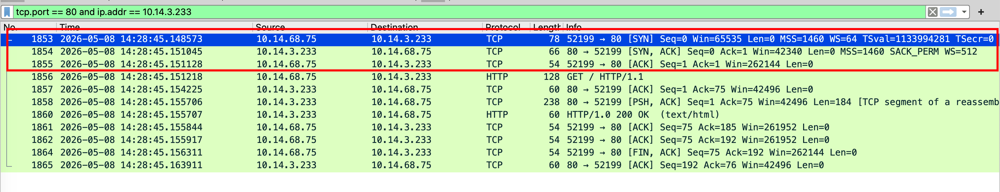
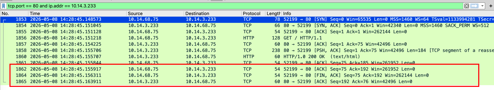

**导语：**
在面试或者学习计算机网络时，一张密密麻麻的 TCP 状态流转图常常让人望而生畏。很多人选择了死记硬背：SYN、ACK、FIN、TIME-WAIT……但只要稍微变个花样问"如果中间丢包了怎么办"，背诵的防线就会瞬间崩溃。

今天，我们不背概念。我们用真实的业务场景和日常生活的比喻，带你彻底看透 TCP 握手与挥手背后的精妙逻辑。读完这篇，你绝对会有一种"茅塞顿开"的爽快感！

<!--more-->

---

## 一、 核心心法：TCP 到底在干嘛？

在开始前，请先在脑海中刻下这句话：**互联网底层的网络环境是极其不可靠的（会丢包、会延迟、会乱序）。**

而 TCP 协议的终极目标，就是在这个不可靠的泥潭上，建立一条**双向通信（全双工）、绝对可靠**的数据通道。所有的握手和挥手，都不是走过场，而是在反复互相确认一件极其重要的事情：**"咱俩的麦克风和听筒，都正常吗？"**

---

## 二、 三次握手：为什么不能是两次？

建立连接的过程被称为"三次握手"。很多人明白第一次和第二次，却死活想不通为什么要进行第三次。

我们想象一下你在用对讲机呼叫网管：

1. **第一次握手（SYN）：**
   - **你：** "网管网管，我是1号机，你能听到吗？完毕。"
   - *潜台词：客户端测试自己的发送能力和服务端的接收能力。*
2. **第二次握手（SYN+ACK）：**
   - **网管：** "收到收到！1号机，我也准备好了，你能听到我吗？完毕。"
   - *潜台词：服务端确认了自己的接收能力正常，并向客户端测试自己的发送能力。*

**【高能预警】如果到这里就结束（只有两次握手），会发生什么？**

此时，客户端听到了网管的回复，心里踏实了。但是！**网管此时慌得一批！** 网管心里想："我刚才发出去的回复，他到底听没听到啊？我的麦克风是不是坏了？"

如果在网络拥堵的情况下，客户端很久以前发出的一条"失效的连接请求"突然到达了服务端。服务端傻傻地回复了同意（第二次握手），并且单方面认为连接建立了，开始苦苦等待客户端发数据。这就会白白浪费服务器极其宝贵的内存和端口资源。

3. **第三次握手（ACK）：**
   - **你：** "网管，我能听到你！完毕。"
   - *潜台词：客户端告诉服务端，你的发送能力和我的接收能力也都完美！*

**总结：** 必须经历完整的"三次握手"，才能确保通信双方的"收"和"发"能力都得到了 100% 的双向验证。

### 📊 图解：三次握手正常建立连接

```text
客户端 (Client)                                          服务端 (Server)
[CLOSED]                                                 [LISTEN]
   |                                                        |
   | ------- (1) SYN, seq=x ------------------------------> |
[SYN-SENT]                                               [SYN-RCVD]
   |                                                        |
   | <------ (2) SYN, seq=y, ACK=x+1 ---------------------- |
   |                                                        |
   | ------- (3) ACK=y+1, seq=x+1 ------------------------> |
[ESTABLISHED]                                            [ESTABLISHED]
   |                                                        |
  (可以开始双向发送数据)                                   (可以开始双向接收数据)
```



## 三、 四次挥手：为什么断开比建立还麻烦？

记住 TCP 的一个重要特性：**全双工通信（双向车道）**。

1. **第一次挥手（FIN）：** 客户端说："服务端，我的数据全发完了，我要关掉我的发送通道了。"
2. **第二次挥手（ACK）：** 服务端说："收到！我知道你发完了。"
   - **【关键点：半关闭状态】** 此时，客户端停止发送，但如果服务端还有数据没传完，它可以**继续传**。
3. **第三次挥手（FIN）：** 等服务端也发完了，它说："客户端，我也彻底发完数据了，我也要关掉了。"
4. **第四次挥手（ACK）：** 客户端回复："收到！那咱们正式拜拜！"

### 📊 图解：四次挥手与半关闭状态

```
客户端 (Client)                                          服务端 (Server)
[ESTABLISHED]                                            [ESTABLISHED]
   |                                                        |
   | ------- (1) FIN, seq=u ------------------------------> |
[FIN-WAIT-1]                                             [CLOSE-WAIT] 
   |                                                        | (服务端仍可发送数据)
   | <------ (2) ACK=u+1 ---------------------------------- |
[FIN-WAIT-2]                                                |
   |                                                        |
   | <------ (3) FIN, seq=w, ACK=u+1 ---------------------- |
   |                                                     [LAST-ACK]
   | ------- (4) ACK=w+1 ---------------------------------> |
[TIME-WAIT]                                              [CLOSED]
   | (等待 2MSL)
[CLOSED]
```



### 💡 理论 vs 现实：为什么抓包只看到了三次挥手？

如果你仔细观察上面的 Wireshark 截图，会发现连接关闭只有 **3 个包**，而不是教科书上的 4 个。这不是 BUG，而是 TCP 协议规范允许的合法优化。

**教科书标准流程（4 个包）：**

```text
Client → Server: FIN        ← 1. 客户端关闭发送方向
Server → Client: ACK        ← 2. 服务端确认收到（但可能还有数据要发）
Server → Client: FIN        ← 3. 服务端也关闭发送方向
Client → Server: ACK        ← 4. 客户端确认收到
```

**现实中常见的优化流程（3 个包）：**

```text
Client → Server: FIN        ← 1. 客户端关闭发送方向
Server → Client: FIN + ACK  ← 2. 服务端把 ACK 和自己的 FIN 合并成一个包
Client → Server: ACK        ← 3. 客户端确认收到
```

**发生的条件很简单：** 当服务端收到 FIN 时，如果自己也**没有数据要继续发了**，TCP 协议栈就会把第 2 步的 ACK 和第 3 步的 FIN 合并成一个 `[FIN, ACK]` 包一起发出去。这种机制叫做"**捎带确认（Piggybacking）**"。

| 场景 | 挥手次数 | 原因 |
|------|---------|------|
| HTTP 短连接，响应完毕后关闭 | **3 次** | 服务端无剩余数据，FIN+ACK 合并 |
| 大文件下载，客户端先断开 | **4 次** | 服务端还在传数据，需要半关闭 |
| 数据库长连接，一方超时断开 | **4 次** | 另一方可能还有事务在执行 |

我们的抓包场景是一个简单的 HTTP GET 请求，服务端返回 200 OK 后就没有更多数据了，所以 TCP 协议栈自然地把 ACK 和 FIN 合并了 —— 这正是理论与实践的差距，也是很多人对着 Wireshark 截图困惑的原因。

------

## 四、 灵魂拷问：如果中间丢包了怎么办？

TCP 的稳健，全靠**超时重传机制**在暗中兜底。

- **请求丢了：** 只要某一方发出了请求（SYN 或 FIN），它就会启动一个定时器。如果超时没收到确认（ACK），它就会认为包丢了，从而**触发重传**。
- **为什么要四次挥手而不是强行关闭？** 如果直接强行断开（RST 报文），缓冲区里还没来得及发出去的数据会瞬间丢失。四次挥手是为了保证数据的完整性。

------

## 五、 令人费解的 TIME-WAIT 状态

客户端发送完最后一个 ACK 后，会进入 `TIME-WAIT` 状态并死守 2MSL 时间。

**为什么要等？**

如果最后一个 ACK 丢了，服务端会重传 FIN。如果客户端立刻关闭了，新建立的连接可能会收到这个"前朝遗留"的 FIN，导致数据错乱（这叫"前朝的剑斩本朝的官"）。`TIME-WAIT` 就是为了确保旧报文在网络中彻底消亡，并给服务端留出重传的机会。

### 📊 图解：TIME-WAIT 的完美兜底

```
客户端 (Client)                                          服务端 (Server)
[TIME-WAIT]                                              [LAST-ACK]
   |                                                        |
   | ------- (4) 最后的 ACK 丢包了！ X                       |
   |                                                        |
   | <------ (超时重传) FIN -------------------------------- |
   |                                                        |
(收到重传 FIN，重置 2MSL)                                    |
   | ------- (再次重发) ACK ------------------------------>  |
   |                                                     [CLOSED]
 (等待 2MSL 结束)
[CLOSED]
```

------

## 结语

TCP 的状态机不是为了复杂而复杂，而是为了在不可靠的网络中追求"绝对可靠"。只要理解了**双向能力确认**和**优雅退出**的逻辑，握手与挥手就不再是难点。下次再有人问你"为什么是三次握手"，你只需要想想那个慈得一批的网管就行了。
